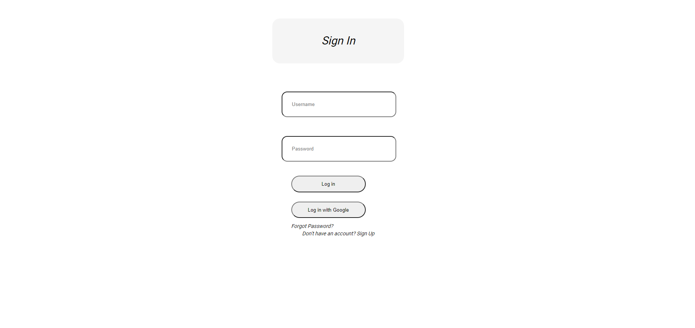
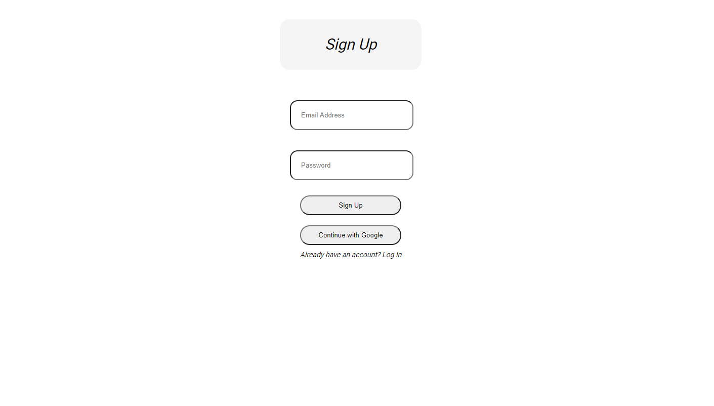
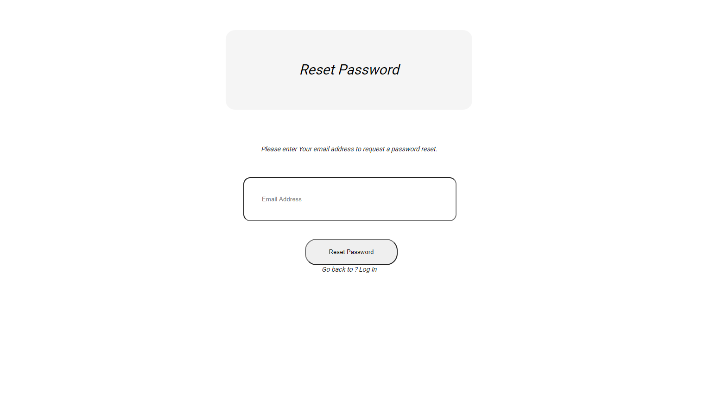
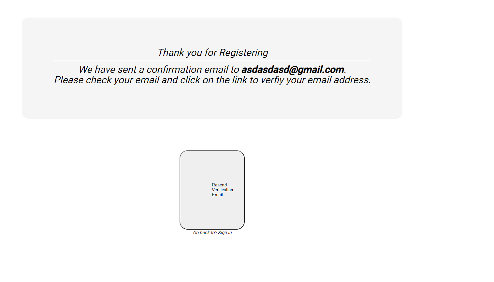
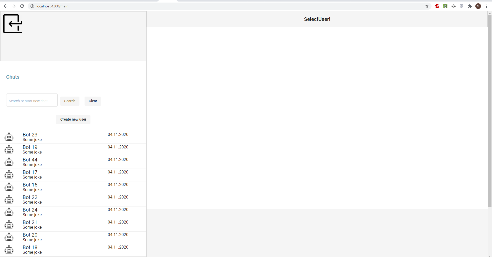
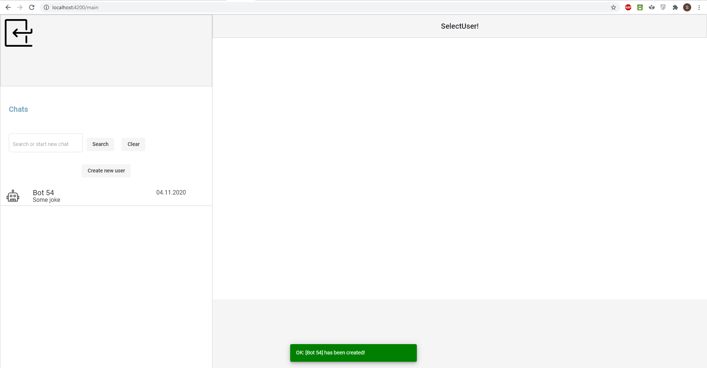
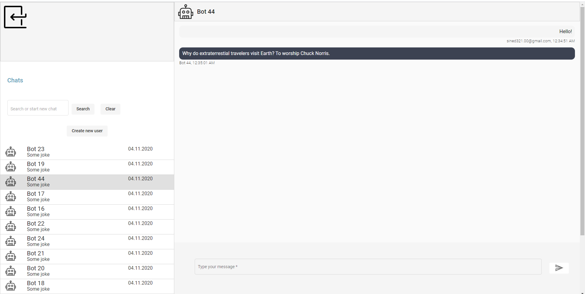
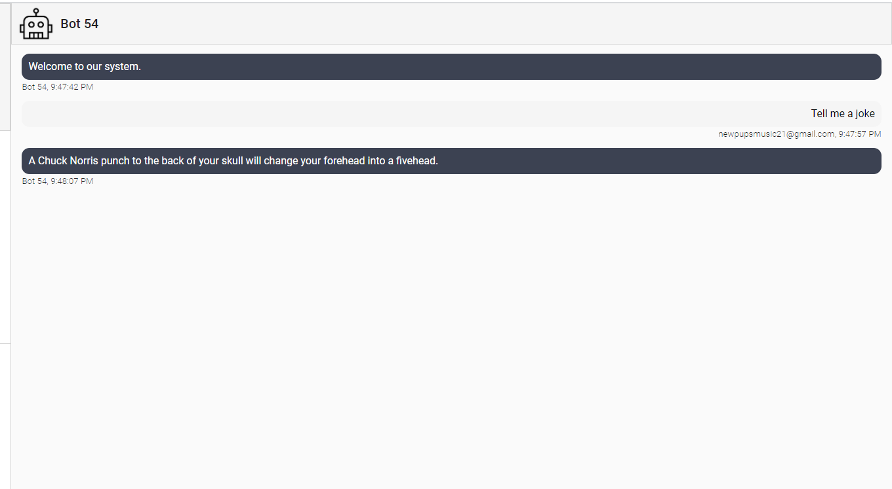
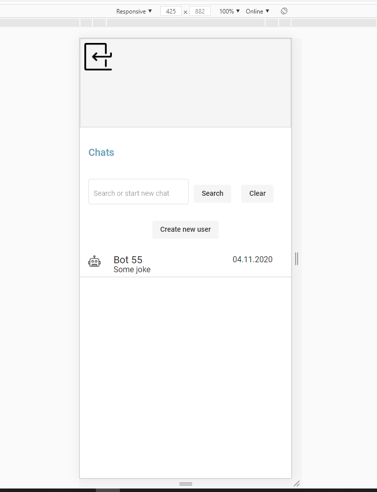
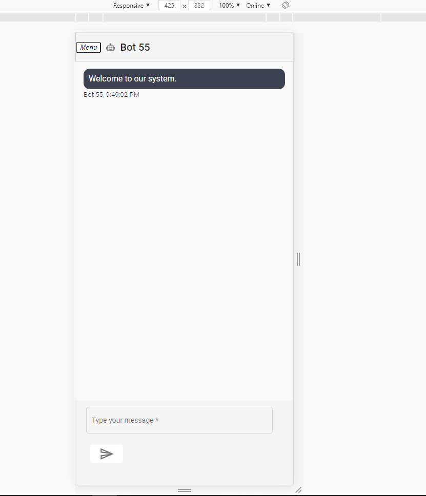

# AngularChatApp

This project is a chat app based on Angunar+Firebase+Node. It uses Node to install packages, Angular for front-end and back-end developing and Firebase for database.

As user you can create bots and chat with them. All the data is stored into Firebase. You will get a responce in 10-15 seconds with a Chunk Norris joke from  https://api.chucknorris.io/ API.

It features Sign-in page[1], Sign-up page[2], Forget password page[3] and Verify email page [4] as for authorization. User can also authorizate with Google.

</img>
 </img>
  </img>
   </img> 

After that User gets on Main page where he can see his User List and chat window. 

</img>

By default User doesn't have any users, so he has to create one by clicking on button.

</img>

User can have a conversation with bot. Bot will reply to every message of user with a joke.

</img>
</img>

There is also an adaptive design for mobile users.

</img>
</img>